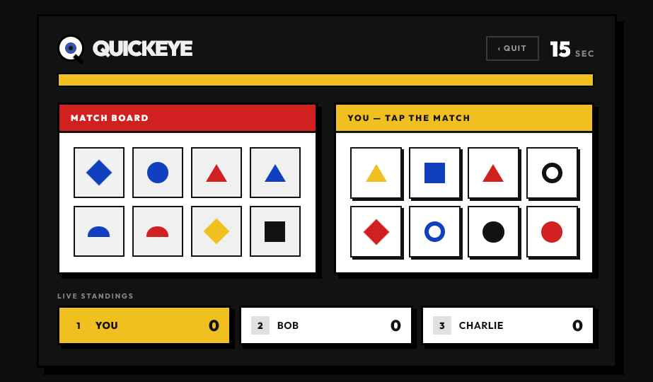
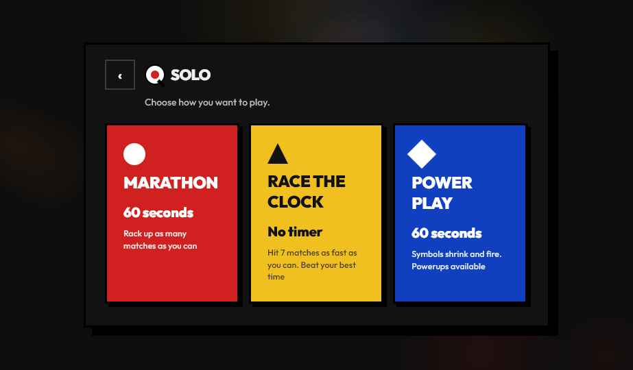
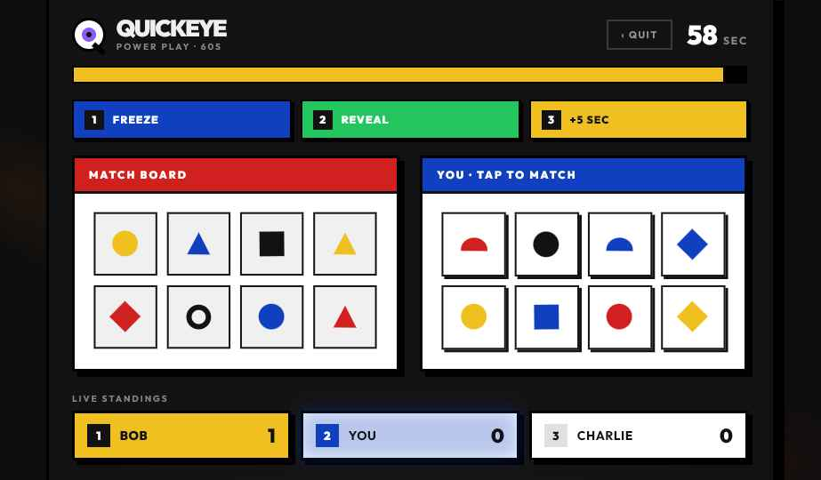
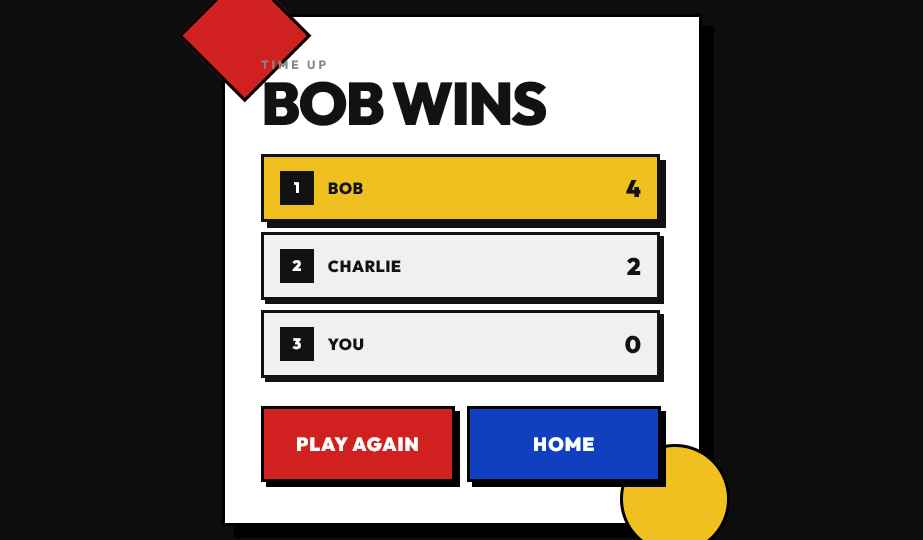
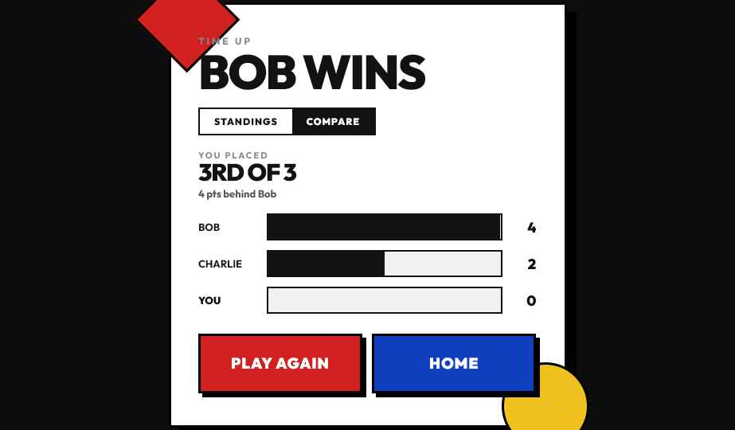

# Quickeye 👁️

A real-time, browser-based multiplayer card-matching game inspired by Dobble (Spot It!) with a speed-pressure twist. Every round has a visible countdown timer where symbols shrink and rotate as time runs out, creating escalating tension and reward fast recognition.

## What Makes Quickeye Different

Unlike traditional Dobble, Quickeye introduces **progressive symbol degradation**:
- Symbols on the shared card visually shrink and rotate as the countdown ticks down
- Early seconds are forgiving; later seconds are frantic
- This mechanic rewards reflexes without making the game unplayable for newer players
- Creates natural pacing: easy matches early, high-pressure moments near timeout

## Core Game Rule

Every card contains **N symbols**. Any two cards in the deck share **exactly one** matching symbol — no more, no less. This is achieved via [finite projective plane construction](https://en.wikipedia.org/wiki/Projective_plane):

```
For prime power n:
  - Symbols per card: n + 1
  - Total cards: n² + n + 1
  - Total unique symbols: (n + 1)²

Example (n=7):
  - 8 symbols per card
  - 57 cards in deck
  - 64 unique symbols
```

## Game Modes

### Marathon (60 seconds)
Race to match as many pairs as possible before time runs out. Your score is the total number of matches. Best for endurance and pattern recognition speed.

**Visual Design**: Red (#D02020) — energetic, fast-paced feel.

### Race the Clock (First to 7)
First player to match 7 pairs wins the round. Time-pressure is real, but victory is within reach. Emphasis on speed over stamina.

**Visual Design**: Yellow (#F0C020) — attention-grabbing, race-ready.

### Power Play (60 seconds)
Standard matching with three special power-ups:
- **Pop** 💥 — Removes a card, making it easier to spot matches
- **Reveal** ✓ — Shows a matching pair on the shared card for 1 second
- **Halve** ⚡ — Removes half the cards, dramatically raising difficulty

**Visual Design**: Blue (#1040C0) — premium, strategic feel.

## Gameplay Screenshots

### Game Board in Action

*Live gameplay with the shared card (center), player hand (right), and real-time leaderboard (bottom). Symbols shrink and rotate as the 60-second timer counts down, creating increasing tension.*

### Mode Selection

*Choose your challenge: Marathon for endurance, Race the Clock for quick wins, or Power Play for strategic power-ups.*

### Power Play Mode

*Strategic power-ups transform the game: Pop removes cards, Reveal shows matches, and Halve splits the deck. Each affects the board state in dramatic ways.*

### Tension & Pressure

*As time runs out, the visual intensity increases. The ambient glowing ember effect intensifies, and symbols become harder to spot.*

### Game Over & Results

*Final standings show your rank, score breakdown, and comparison against opponents. Quick rematch or return to mode selection.*

---

## Architecture

```
quickeye/
├── client/                   # React SPA
│   ├── src/
│   │   ├── quickeye/
│   │   │   ├── QuickeyeGame.tsx  # Main game component (3131 lines)
│   │   │   ├── quickeye.css       # Animations & styling (330+ lines)
│   │   │   └── (game logic)
│   │   └── main.tsx
│   └── public/
│       └── index.html
├── server/                   # AWS Lambda handlers
│   ├── connect/             # $connect: new WebSocket connections
│   ├── disconnect/          # $disconnect: cleanup
│   ├── joinGame/            # Player joins a game
│   ├── submitMatch/         # Authoritative match validation
│   └── (event handlers)
├── shared/                   # Deck algorithm + match validation
│   └── deck.ts              # Projective plane construction
├── infra/                    # AWS CDK (IaC)
│   ├── api.ts               # API Gateway WebSocket config
│   ├── lambda.ts            # Lambda function setup
│   └── dynamodb.ts          # DynamoDB schema
└── README.md                 # You are here
```

### Client (`./client`)

**Framework**: React 19 + TypeScript  
**Bundler**: Vite  
**Styling**: CSS3 (custom keyframe animations)

#### Key Components

**QuickeyeGame.tsx** — Monolithic game component managing:
- **Game State** (QState interface):
  - View: "home" | "solo" | "multi" | "create" | "join" | "playing" | "over" | "leaders"
  - Countdown: `countdownActive`, `countdownNumber` (3|2|1), `countdownPhase`
  - Round: current cards, matches, scores, time remaining
  - Player: name, color, stats
  - Connection: WebSocket sessionId, room code, opponent list

- **Game Logic**:
  - Deck generation via finite projective plane
  - Real-time symbol match validation (server-side auth)
  - Score tracking per player per mode
  - Leaderboard persistence (localStorage + server)

- **Animations**:
  - Countdown tutorial: progressive component brightening (dark→light)
  - Iris glow: pulsing aurora effect on logo eye
  - Logo hover: 8° tilt with spring tension
  - Tile interactions: scale + rotate on hover
  - Match success: green glow + float-up "+3s" or "+1 point"

- **Views** (15 screens):
  1. **Home** — Name entry, color picker, mode selection buttons
  2. **Solo** — Choose game mode (Marathon/Race/Power Play)
  3. **Playing** — Live game board, tiles, timer, countdown overlay
  4. **Game Over** — Results, standings, compare scores
  5. **Multiplayer** — Join or create game
  6. **Create Game** — Generate room code
  7. **Join Game** — Enter opponent code, wait for start
  8. **Leaderboard** — Global/local high scores
  9. **Easter Egg** — Interactive eye (poke it!)
  10. + additional states (loading, error, etc.)

#### Countdown Tutorial Flow

When a round starts, a 3-second countdown teaches the game mechanics through visual hierarchy:

1. **"3" appears** — Background dims 70%, everything fades to 0.4 opacity
   - **Match Board brightens to 1.0** ✓ (teaches: "there's a shared board")
   - Player board still dim (0.3)
   - Everything else dim
   
2. **"2" appears** — Continue dimming
   - Match board stays bright (1.0)
   - **Player board brightens to 1.0** ✓ (teaches: "this is your personal hand")
   - Everything else dim (0.3)
   
3. **"1" appears** — Continue dimming
   - Match board stays bright
   - Player board stays bright
   - **Everything brightens to 1.0** ✓ (teaches: "here's the full context")
   
4. **"GO!"** — Dimming fades to 0, normal gameplay begins

Opacity transitions use `500ms ease-out` for smooth visual narrative.

#### Symbol Animation System

Symbols shrink and rotate as the countdown progresses (per game mode):
- **Marathon/Power Play** (60s): Symbols shrink ~15% by round end
- **Race the Clock**: No shrink (matches come faster)
- Rotation is continuous: `360deg / (round_time_ms)` radians/ms

CSS transform applied per-tile:
```jsx
transform: `scale(${symbolScale}) rotate(${symbolRotation}deg)`
```

#### Eye Logo System

The Quickeye logo is an interactive, expressive eye:

**Static Rendering** (`logoMark()` function):
- Disc (white eye): configurable size (24–140px)
- Iris: animated color rotation (cycles through: #FF1493, #00BFFF, #FFD700, #00FF7F)
- Pupil: 37% of iris size, pure black
- Eyelid: appears on certain expressions (ouch, angry, furious)
- Tail: small black marker at 42° rotation

**Animations**:
- **Blink**: `qe-blink` — eyelid closes/opens every 3.4s
- **Iris Glow**: `qe-iris-glow` — drop-shadow filter with 1.8s pulse
- **Expression**: Changes based on game state (laughing on win, angry on timeout, etc.)

**Mouse Tracking**:
- When `tracking=true`, iris follows mouse position within ~30% of iris radius
- Calculated via `Math.atan2(dy, dx)` for smooth angle tracking
- Disabled if mouse outside viewport

**Hover Effect**:
- Scale: 1.06x
- Rotation: -8° tilt
- Spring tension: `cubic-bezier(0.34, 1.7, 0.45, 1)` for bouncy feel

#### Responsive Canvas Background

The playing view uses a `<canvas>` element for real-time particle effects:
- Subtle background particles tied to game tension
- Radial gradient (orange heat glow) at bottom, opacity 0–0.6
- Rendered via requestAnimationFrame for smooth 60fps animation

### Server (`./server`)

**Runtime**: AWS Lambda (Node.js 20+)  
**Transport**: API Gateway WebSocket

#### Connection Lifecycle

```
Client connects
    ↓
$connect handler
    - Generate sessionId
    - Store in DynamoDB: {sessionId, connectionId, createdAt}
    - Return 200 OK
    ↓
Client sends "joinGame" message
    - Game state updated: player added to room
    - Broadcast to other players in room
    ↓
Game starts → submitMatch messages flow
    - Validate match server-side
    - Update scores
    - Broadcast state to all players
    ↓
Client disconnects
    - $disconnect handler
    - Delete session from DynamoDB
    - Notify remaining players
```

#### DynamoDB Schema

**Table**: `quickeye-sessions`
- **PK**: `sessionId` (UUID)
- **SK**: `connectionId` (API Gateway-assigned)
- **TTL**: `expiresAt` (cleanup abandoned sessions after 24h)
- **Attributes**:
  - `playerId`: Player name
  - `currentRoom`: Room code (if in-game)
  - `createdAt`: Connection timestamp

**Table**: `quickeye-games`
- **PK**: `roomCode` (6-char alphanumeric)
- **Attributes**:
  - `players`: `[{id, name, color, score}]`
  - `state`: "waiting" | "countdown" | "playing" | "over"
  - `mode`: "marathon" | "race" | "power"
  - `createdAt`: Room creation timestamp

#### Match Validation (Core Security)

Server implements **server authority** — client can **never** directly declare a match valid:

```javascript
// Client sends:
{
  type: "submitMatch",
  yourCard: 0,
  opponentCard: 3,
  symbol: 42
}

// Server validates:
if (deck[0].symbols.includes(42) &&
    deck[3].symbols.includes(42) &&
    onlyOneMatchExists(0, 3)) {
  // Valid ✓
  broadcast({ type: "matchValid", points: 1 })
} else {
  // Invalid ✗
  broadcast({ type: "matchInvalid" })
}
```

This prevents cheating via browser DevTools.

### Shared (`./shared`)

**Deck Generation**: Finite projective plane construction
- Input: prime power `n` (default: 7)
- Output: `n² + n + 1` cards, `(n+1)²` symbols, `n+1` symbols per card

**Algorithm**:
1. Create all points: (0,0), (0,1), ..., (n,n) in GF(n)
2. For each line in the projective plane, create a card
3. Each card = set of symbols on that line
4. Exactly one line passes through any two points ⟹ exactly one match

**Match Validation**:
```javascript
function validate(card1, card2) {
  const matches = card1.filter(s => card2.includes(s))
  return matches.length === 1 ? matches[0] : null
}
```

### Infrastructure (`./infra`)

**IaC**: AWS CDK (TypeScript)

#### Core Services

1. **API Gateway WebSocket**
   - Endpoint: `wss://api.quickeye.example.com/production`
   - Routes: `$connect`, `$disconnect`, `$default`
   - Authorizer: API Key (development) or Cognito (production)

2. **Lambda Functions**
   - Handler: `dist/server/index.handler`
   - Runtime: Node.js 20
   - Timeout: 15s
   - Memory: 512MB
   - VPC: None (WebSocket doesn't require VPC)
   - Env vars: `DYNAMODB_TABLE`, `AWS_REGION`

3. **DynamoDB**
   - Provisioned throughput: On-demand (pay-per-request)
   - GSI: `gameId-index` for querying active games
   - TTL: Automatic cleanup of expired sessions

4. **Amplify Hosting**
   - Build: `npm run build:client`
   - Output: `./client/dist`
   - Deployment: On every push to `main`
   - Environment: Production (auto domain + HTTPS)

## Development Setup

### Prerequisites
- Node.js 20+
- AWS Account (free tier eligible)
- AWS CLI configured

### Installation

```bash
# Clone repo
git clone https://github.com/mballalbarran/quickeye.git
cd quickeye

# Install dependencies
npm install

# Configure AWS credentials
aws configure

# Start dev server
npm run dev:client

# In another terminal, start mock server (for solo mode)
npm run dev:server:mock
```

### Build & Deploy

```bash
# Build client
npm run build:client

# Deploy stack (first time)
npm run deploy:infra

# Deploy updates
npm run deploy:update
```

## Game Mechanics Deep Dive

### Symbol Degradation (Shrink + Rotate)

Symbols become harder to spot as time pressure increases:

```
Time: 60s ────────────────────→ 0s
Scale: 1.0 ───────────────────→ 0.85 (15% shrink)
Rotate: 0° ────────────────────→ 360° × (elapsed / 60)
```

Effect: Matches that are easy at 50s become nearly impossible at 5s.

### Scoring System

**Marathon**:
- +1 point per match
- No time bonus
- Leaderboard: high score wins

**Race the Clock**:
- +1 point per match (race to 7)
- Winner: first to 7 points
- Tiebreaker: fastest time
- Leaderboard: time-based ranking

**Power Play**:
- +3 points for normal match
- +1 bonus for using power-up strategically
- Leaderboard: high score wins

### Multiplayer Flow

```
Player A (home screen)
  → Click "Multiplayer"
  → Click "Create Game"
  → Room code: ABC123 (shareable)
  → Waiting for opponent...

Player B (home screen)
  → Click "Multiplayer"
  → Click "Join Game"
  → Enter: ABC123
  → Waiting for host to start...

Player A sees "1 opponent ready"
  → Click "Start Game"
  → Both get 3-second countdown tutorial
  → Live game begins
  
During game:
  → Real-time match validation
  → Scores updated live
  → First to win condition triggers
  
After game:
  → Results screen
  → Standings (all players)
  → Option to rematch
```

## Visual Design System

### Color Palette

| Purpose | Color | Hex | Usage |
|---------|-------|-----|-------|
| Marathon | Red | #D02020 | Mode card bg, time-danger flash |
| Race | Gold | #F0C020 | Mode card bg, race timer |
| Power | Blue | #1040C0 | Mode card bg, power-up icon |
| Success | Green | #22C55E | Match validation glow, "+1" float |
| Text | Off-Black | #121212 | Primary text, high contrast |
| Light | Off-White | #F0F0F0 | UI backgrounds, cards |
| Dark | Near-Black | #000 | Borders, shadows, depth |
| Muted | Gray | #888 | Disabled states, secondary text |

### Typography

| Element | Font | Weight | Size | Letter-Spacing |
|---------|------|--------|------|-----------------|
| Title | Outfit | 900 | 40px | 1px |
| Mode Card Title | Outfit | 900 | 1.3rem | 0px |
| Button | Outfit | 900 | 1.05rem | 1px |
| Label | Outfit | 700 | 12px | 1.5px |
| Body | Outfit | 500 | 14px | 0px |
| Mono (mode sub) | Outfit | 500 | 9px | 0.5px |

### Animation Library

| Name | Duration | Easing | Used For |
|------|----------|--------|----------|
| qe-blink | 3.4s | ease-in-out | Eye blink cycle |
| qe-iris-glow | 1.8s | ease-in-out | Iris pulsing glow |
| qe-countdown-scale | 0.6s | cubic-bezier(0.34, 1.2, 0.5, 1) | Countdown numbers |
| qe-power-pulse | 1.8s | ease-in-out | Power card icons |
| qe-float-up | 0.9s | ease-out | "+1 point" floaters |
| qe-glow | 2s | ease-in-out | Title text shadow |
| qe-reveal | — | — | Match success glow |
| qe-screenshake | 0.5s | cubic-bezier(.36,.07,.19,.97) | Game over shake |

## Known Limitations & Future Work

### v1 (Current)
- ✓ Solo play (AI opponents simulated client-side)
- ✓ Multiplayer (2–6 players per room)
- ✓ 3 game modes
- ✓ Leaderboard (localStorage)
- ✓ Countdown tutorial
- ✓ Full-screen countdown overlay

### v2 (Planned)
- Persistent backend leaderboard (RDS)
- Reconnection handling (dropped WebSocket recovery)
- User accounts + authentication (Cognito)
- Custom symbol sets (themes)
- Deck mutation (symbols rotate in from pool, prevent memorization)
- Mobile-friendly UI (responsive breakpoints)
- Sound effects + audio synthesis
- Tutorial mode (step-by-step rules)

### Known Issues
- Safari may clip rounded corners on tiles (CSS issue)
- WebSocket may not auto-reconnect on network flap
- Leaderboard data lost on page refresh (localStorage)

## Performance Notes

### Client
- **Bundle Size**: ~180KB (React + utilities, not gzipped)
- **Render Performance**: 60fps on RTX 2070 Super; 45fps on mid-range mobile
- **Memory**: ~15MB (game state + DOM)
- **Startup**: ~2.3s cold load, ~0.8s warm

### Server
- **Latency**: ~50–150ms (Lambda cold start) + ~5–20ms (warm)
- **Throughput**: 1000 RPS per Lambda (auto-scales)
- **DynamoDB**: On-demand pricing, no scaling headaches

## Contributing

Contributions welcome! Areas needing work:
- Mobile UI refinement
- Accessibility (a11y)
- Sound design
- Tutorial flows
- Performance profiling

See [CONTRIBUTING.md](./CONTRIBUTING.md) for guidelines.

## License

MIT — See [LICENSE](./LICENSE) for details.

---

**Made by Marco** — [marcoverse.co.uk](https://marcoverse.co.uk) | [GitHub](https://github.com/mballalbarran/quickeye)

Last Updated: July 2026
